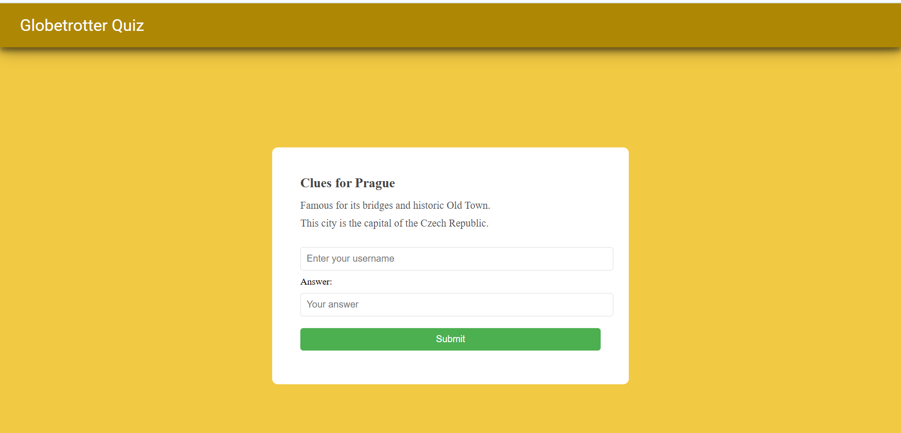
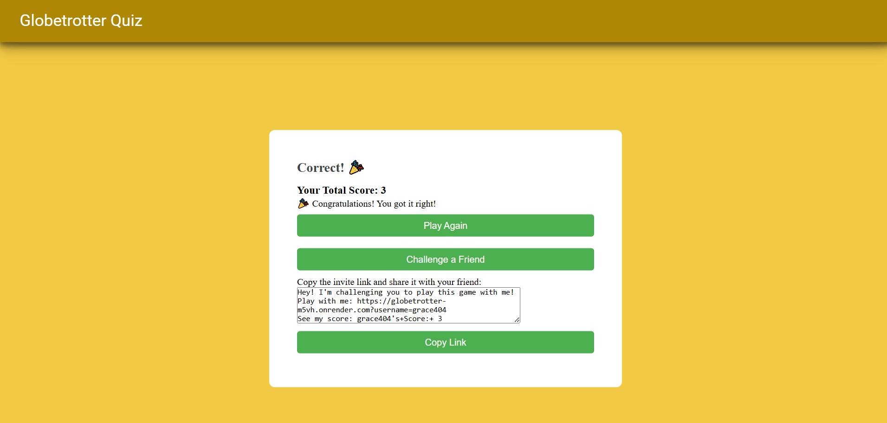

# Globetrotter Quiz




**Globetrotter** is an interactive quiz game where users guess famous destinations based on cryptic clues. Players can challenge their friends by sharing dynamic invite links, and the app features score tracking, animated feedback, and multiple-choice questions.

## Table of Contents

- [Features](#features)
- [Demo](#demo)
- [Diagram](#diagram)
- [Technologies Used](#technologies-used)
- [Installation](#installation)
- [API Endpoints](#api-endpoints)
- [Contributing](#contributing)

## Features

- Random clue generation with multiple-choice answers
- Score tracking with feedback (confetti animation for correct answers, sad face for incorrect ones)
- Play Again and Challenge a Friend options
- Dynamic invite links for friend challenges
- Responsive UI designed for a smooth user experience
- User registration and profile creation (for Challenge a Friend feature)
- Fun facts and trivia for each destination

## Demo

You can try out the GoBuddy live [here](https://globetrotter-m5vh.onrender.com).


## Diagram

```
+-----------------+              +-------------+
|   Destination   |1           * |    Clue     |
+-----------------+ <----------> +-------------+
| - id: Long      |              | - id: Long  |
| - name: String  |              | - clueText: String |
| - correctAnswer: String|       | - destination_id: Long|
+-----------------+              +-------------+
        ^                               
        |                               
        |                                
        |1           *         
        |            +-------------+
        |         *  |  FunFact    |
        +------------+-------------+
                     | - id: Long  |
                     | - funFactText: String |
                     | - destination_id: Long|
                     +-------------+

+-----------------+
|      User       |
+-----------------+
| - id: Long      |
| - username: String |
| - score: Integer |
+-----------------+


```

**In this model:**

- Destination has a one-to-many relationship with Clue and FunFact.
- Clue and FunFact each have a foreign key (destination_id) that references Destination.

## Technologies Used

- JAVA17
- Spring Boot
- Spring Web
- Spring Data JPA
- Spring Security
- Spring MVC
- PostgreSQL
- Lombok
- HTML
- CSS
- Thymeleaf
- Maven


## Installation

To run this project locally, follow these steps:

1. Clone the repository:

    ```bash
   git clone https://github.com/omgupta7352/Globetrotter.git

    ```

2. Navigate to the project directory:

    ```bash
    cd /Globetrotter
    ```


3. Build and run the application:

    ```bash
    mvn clean install
    ```

    ```bash
    mvn spring-boot:run
    ```

## API Endpoints

### 1. Start Game
- **Method**: `GET`
- **Endpoint**: `/`
- **Description**: Start the game, fetches a random destination, clues, and fun facts.

### 2. Submit Answer
- **Method**: `POST`
- **Endpoint**: `/submitAnswer`
- **Parameters**: `username`, `destinationId`, `userAnswer`
- **Description**: Submit user's answer, check correctness, and update score.

### 3. Challenge Friend
- **Method**: `POST`
- **Endpoint**: `/challengeFriend`
- **Parameters**: `username`
- **Description**: Generate an invite link and dynamic image for challenging a friend.

### 4. Handle Friend Invitation
- **Method**: `GET`
- **Endpoint**: `/game/invite`
- **Parameters**: `username`
- **Description**: Handle the invite link sent to a friend, redirect to the game page.


## Contributing

Contributions are welcome! If you would like to contribute to this project, please follow these steps:

1. Fork the repository.
2. Create a new branch for your feature or bugfix:

    ```bash
    git checkout -b feature/your-feature-name
    ```

3. Commit your changes:

    ```bash
    git commit -m 'Add some feature'
    ```

4. Push to the branch:

    ```bash
    git push origin feature/your-feature-name
    ```

5. Open a pull request on GitHub.
